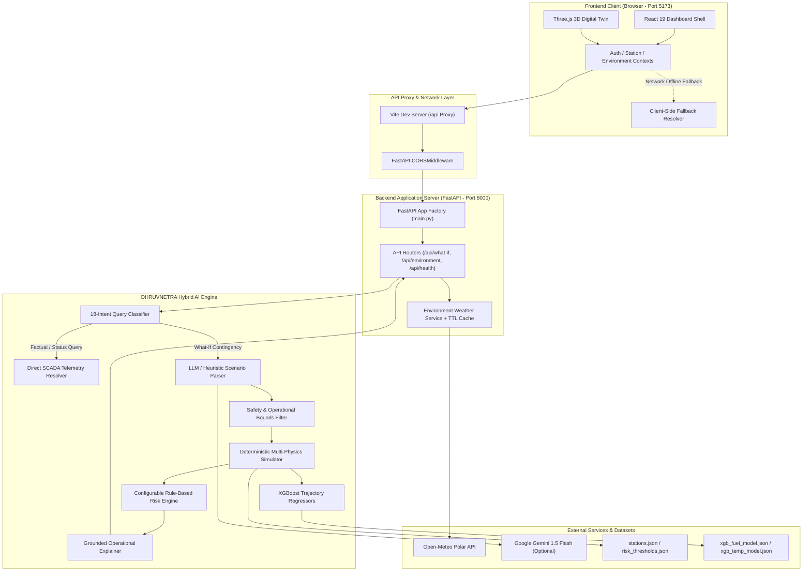
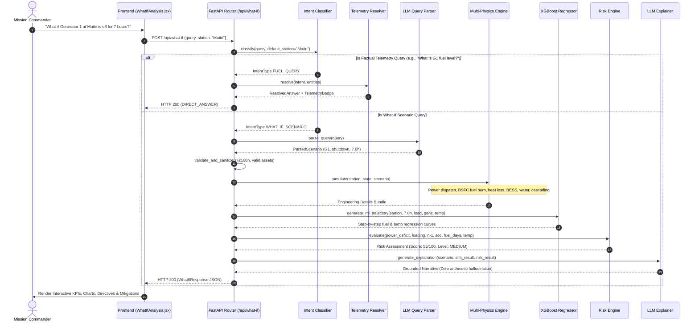
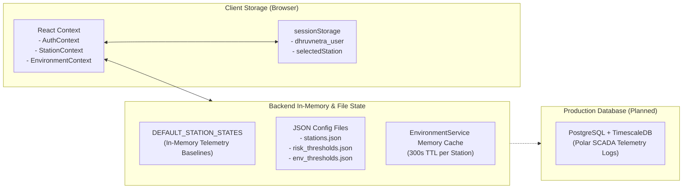

# DHRUVNETRA (ध्रुवनेत्र) — Polar Digital Twin & AI Mission Intelligence Engine

> **SIH 2026 Problem Statement**: *Digital Platform for Remote Management of Indian Antarctic Research Stations (**Maitri** & **Bharati**)*  
> High-fidelity digital twin, real-time Antarctic meteorology telemetry, hybrid physics-grounded AI What-If contingency simulation, XGBoost trajectory regression, multi-subsystem risk engine, and role-based mission command center.

---

```
  ____  _   _ ____  _   ___     ___   _ _____ _____ ____      _    
 |  _ \| | | |  _ \| | | \ \   / / \ | | ____|_   _|  _ \    / \   
 | | | | |_| | |_) | | | |\ \ / /|  \| |  _|   | | | |_) |  / _ \  
 | |_| |  _  |  _ <| |_| | \ V / | |\  | |___  | | |  _ <  / ___ \ 
 |____/|_| |_|_| \_\\___/   \_/  |_| \_|_____| |_| |_| \_\/_/   \_\
   INDIAN ANTARCTIC RESEARCH STATIONS DIGITAL TWIN & AI ASSISTANT   
               MAITRI (70°S, 11°E) · BHARATI (69°S, 76°E)
```

---

## Table of Contents

1. [Project Overview](#1-project-overview)
2. [Problem Being Solved](#2-problem-being-solved)
3. [Project Goals & Architectural Principles](#3-project-goals--architectural-principles)
4. [Current Implementation Status](#4-current-implementation-status)
5. [Key Features & Capabilities](#5-key-features--capabilities)
6. [Technology Stack & Dependencies](#6-technology-stack--dependencies)
7. [System Architecture](#7-system-architecture)
8. [Complete Project File Structure](#8-complete-project-file-structure)
9. [Frontend Architecture](#9-frontend-architecture)
10. [Backend Architecture](#10-backend-architecture)
11. [AI & ML Architecture (Strict Hybrid Engine)](#11-ai--ml-architecture-strict-hybrid-engine)
12. [Database & State Architecture](#12-database--state-architecture)
13. [Authentication & Security (RBAC)](#13-authentication--security-rbac)
14. [Application Flow & User Journey](#14-application-flow--user-journey)
15. [Data Flow Pipelines](#15-data-flow-pipelines)
16. [Frontend Routes & Navigation Matrix](#16-frontend-routes--navigation-matrix)
17. [Backend API Documentation](#17-backend-api-documentation)
18. [Data Models & Schema Reference](#18-data-models--schema-reference)
19. [Dependency Manifest](#19-dependency-manifest)
20. [Environment Variables & Configuration](#20-environment-variables--configuration)
21. [Installation & Setup Guide](#21-installation--setup-guide)
22. [Running the Application](#22-running-the-application)
23. [Automated Testing & System Verification](#23-automated-testing--system-verification)
24. [Build & Production Deployment](#24-build--production-deployment)
25. [Feature Matrix (Implemented vs Planned)](#25-feature-matrix-implemented-vs-planned)
26. [Mock vs Real Data Breakdown](#26-mock-vs-real-data-breakdown)
27. [Known Limitations & Prototype Boundaries](#27-known-limitations--prototype-boundaries)
28. [Future Roadmap](#28-future-roadmap)
29. [Development Guidelines & Engineering Conventions](#29-development-guidelines--engineering-conventions)
30. [AI Development Context & Safe Extension Rules](#30-ai-development-context--safe-extension-rules)
31. [AI Context Snapshot (Machine-Readable YAML)](#31-ai-context-snapshot-machine-readable-yaml)
32. [Credits, Team & License](#32-credits-team--license)

---

## 1. Project Overview

**DHRUVNETRA** (Sanskrit for *"Eye of the Pole"* / *Polar Watcher*) is a specialized digital twin and remote operational intelligence platform developed for the **National Centre for Polar and Ocean Research (NCPOR)** and the **Ministry of Earth Sciences (MoES), Government of India**.

The system enables mission commanders in India and on-site station engineers in Antarctica to monitor, simulate, and manage the critical life-support and engineering subsystems of India's two permanent Antarctic research bases:
* **Maitri Station** ($70^\circ 45' 58''\text{ S}, 11^\circ 44' 09''\text{ E}$, established 1989, Schirmacher Oasis, Queen Maud Land)
* **Bharati Station** ($69^\circ 24' 28''\text{ S}, 76^\circ 11' 14''\text{ E}$, established 2012, Larsemann Hills, Princess Elizabeth Land)

### Primary Operational Pillars
1. **Interactive 3D Digital Twin**: Low-latency 3D structural model rendered in WebGL (Three.js / React Three Fiber) with interactive subsystem nodes (powerhouse, habitat, labs, fuel tanks, BESS battery banks, satellite radomes, helipads).
2. **Real-Time Polar Meteorology**: Live weather data ingested from external polar numerical weather models via Open-Meteo with TTL caching, polar wind chill calculations, blizzard triggers, and environmental threshold alerts.
3. **Conversational AI Mission Assistant**: Multi-intent operational assistant supporting 18 distinct intent categories, pronoun resolution, and contextual follow-ups.
4. **Hybrid Physics-Grounded What-If Engine**: Deterministic multi-physics simulation coupled with trained XGBoost regression models for fuel burn and indoor temperature dynamics, eliminating LLM arithmetic hallucinations.
5. **Mitigation Optimization & Cascading Failure Tracing**: Multi-step dependency modeling tracing cascading failures and comparing mitigation strategies side-by-side.
6. **Role-Based Mission Command**: Role-Based Access Control (RBAC) supporting Admin, Operator, and Viewer clearance levels, secure satellite directive transmission simulations, and automated compliance reporting.

---

## 2. Problem Being Solved

Operating human research habitats in Antarctica represents one of the harshest engineering challenges on Earth:
* **Extreme Cold & Katabatic Winds**: Ambient temperatures plunge below $-40^\circ\text{C}$ with katabatic blizzard wind gusts exceeding $120\text{ km/h}$.
* **Isolation & Supply Line Fragility**: Stations are cut off from maritime resupply for up to 8 months annually during polar winter.
* **Cascading Subsystem Interdependence**: Electrical power loss leads directly to water pipeline freeze-up within hours, failure of snow melters, and habitat thermal collapse.
* **Human Cognitive Fatigue in Crises**: Station commanders must evaluate high-consequence operational decisions (e.g., generator maintenance shutdowns, fuel rationing during blizzard resupply delays) without real-time simulation tools.

**DHRUVNETRA solves this by providing a single pane of glass for real-time monitoring and a deterministic What-If simulation engine to safely test operational contingencies before executing physical changes.**

---

## 3. Project Goals & Architectural Principles

```
  ┌─────────────────────────────────────────────────────────────────────────┐
  │                    CORE ARCHITECTURAL PRINCIPLES                        │
  ├─────────────────────────────────────────────────────────────────────────┤
  │ 1. ZERO LLM ARITHMETIC       Pre-trained LLMs NEVER calculate physics.  │
  │                              All numbers come from deterministic models │
  │                              and verified XGBoost regressors.           │
  ├─────────────────────────────────────────────────────────────────────────┤
  │ 2. FACTUAL TELEMETRY ISOLATION Factual questions resolve directly from  │
  │                              SCADA state with 0 What-If simulation overhead.│
  ├─────────────────────────────────────────────────────────────────────────┤
  │ 3. RESILIENT FALLBACKS       System functions completely offline with    │
  │                              heuristic semantic parsers if external API │
  │                              providers (Gemini/OpenAI/Ollama) fail.     │
  ├─────────────────────────────────────────────────────────────────────────┤
  │ 4. STRICT SAFETY BOUNDARIES  Simulations enforce operational ceilings   │
  │                              (max 168h duration, station validation).   │
  └─────────────────────────────────────────────────────────────────────────┘
```

---

## 4. Current Implementation Status

| Component | Technology | Implementation State | Verification |
| :--- | :--- | :--- | :--- |
| **Frontend Shell & UI** | React 19 + Vite 8 + Tailwind 4 | **COMPLETE / PRODUCTION-READY** | Verified in browser & test suite |
| **3D Digital Twin** | Three.js + R3F + Drei | **COMPLETE** (Maitri & Bharati) | Interactive node inspection |
| **Subsystem Dashboards** | React State & Context API | **COMPLETE** (8 dedicated pages) | Telemetry & chart rendering |
| **Backend Framework** | FastAPI 0.110 + Uvicorn | **COMPLETE** | Full REST endpoints & OpenAPI |
| **Polar Weather API** | Open-Meteo Integration | **COMPLETE / LIVE** | Real-time coordinates query |
| **Intent Classifier** | Semantic Regex & Rule Engine | **COMPLETE** (18 intents) | Multi-turn & follow-up tests |
| **LLM Query Parser** | Multi-Provider + Heuristic Fallback | **COMPLETE** (Gemini/OpenAI/Ollama) | Automated parser test suite |
| **Multi-Physics Engine** | Deterministic Python Modules | **COMPLETE** (Power/Fuel/Thermal/BESS) | Bit-identical repeatability |
| **ML Trajectory Regressors** | XGBoost 2.0 (Fuel & Temp) | **COMPLETE** (Trained on 17.5k rows) | Model MAE verified in audit |
| **Risk Engine** | Centralized JSON Thresholds | **COMPLETE** (4 risk tiers) | Tested across 7 risk vectors |
| **Auth & Security** | RBAC (Admin, Operator, Viewer) | **PROTOTYPE RBAC** (sessionStorage) | Route guards + API headers |
| **Database Persistence** | In-memory SCADA / JSON / Session | **IN-MEMORY MOCK / PROTOTYPE** | Production DB is planned |

---

## 5. Key Features & Capabilities

### 5.1 Subsystem Monitoring Matrix
* **Power Microgrid**: Multi-generator dispatch, bus frequency ($50\text{ Hz}$ nominal), bus voltage ($415\text{V}$), BESS battery SOC, solar PV yield, and class-priority load shedding.
* **Fuel Storage**: Bulk storage tank telemetry ($81,600\text{ L}$ Maitri, $136,800\text{ L}$ Bharati), generator day tank balances, fuel consumption rates ($\text{L/h}$), Arctic-grade diesel (HSD-A) reserve endurance (days), and pipeline trace heating status.
* **HVAC & Life Support**: Interior habitat temperatures across accommodation, laboratories, and bridge modules; glycol thermal loop loads; katabatic wind forced convective heat loss; airlock door seal integrity.
* **Water & Sanitation**: Strategic potable water reserves ($18,200\text{ L}$ Maitri, $23,500\text{ L}$ Bharati), snow melter electrical draw and production ($\text{L/h}$), Priyadarshini Lake heated pipeline telemetry, and wastewater purification recycling.
* **Polar Environment & Meteorology**: Real-time ambient temperature, wind speed and gusts ($\text{km/h}$ and $\text{m/s}$), barometric pressure ($\text{hPa}$), wind chill index, cloud cover, visibility ($\text{km}$), and blizzard warning triggers.
* **Logistics & Fleet Management**: PistenBully tracked vehicles, snowmobiles, crane readiness, winter resupply buffers, food rations runway, and critical spare parts inventory.
* **Centralized Alert Center**: Multi-level alert matrix (Critical, Warning, Advisory) across power, thermal, fuel, environmental, and security channels with acknowledge and mute workflows.

### 5.2 Hybrid AI What-If Analysis Engine
* **Natural Language Queries**: Commanders type free-form operational questions:
  * *"What if Generator 1 at Maitri is turned off for 7 hours?"*
  * *"What if G1 and G2 both fail during a -35°C blizzard?"*
  * *"What if fuel delivery is delayed by 14 days?"*
  * *"What if water purification plant fails for 24 hours?"*
  * *"Which generator is safer to shut down for maintenance?"*
* **Side-by-Side Scenario Comparison**: Compares Scenario A vs Scenario B with dynamic delta calculations for power deficit, fuel saved, thermal impact, and station health scores.
* **Mitigation Recommendation**: Evaluates automated mitigations (Auto-Start Warm Standby, Class-2 Non-Critical Load Shedding, HVAC Eco-Setback) and ranks them by risk reduction.
* **Timeline Trajectory Forecasting**: Multi-step curve predictions for power demand, capacity, fuel burn, indoor temperature, water runway, and health score.

---

## 6. Technology Stack & Dependencies

```
┌──────────────────────────────────────────────────────────────────────────────────┐
│                                 DHRUVNETRA STACK                                 │
├─────────────────────────┬──────────────────────────────┬─────────────────────────┤
│ FRONTEND LAYER          │ BACKEND API & PHYSICS        │ AI & MACHINE LEARNING   │
├─────────────────────────┼──────────────────────────────┼─────────────────────────┤
│ • React 19.2.8          │ • Python 3.10+ (tested 3.14) │ • XGBoost 2.0.0+        │
│ • Vite 8.2.2            │ • FastAPI 0.110.0+           │ • Scikit-learn 1.4.0+   │
│ • Tailwind CSS 4.3.3    │ • Uvicorn 0.28.0+            │ • Joblib 1.3.0+         │
│ • Three.js 0.185.1      │ • Pydantic 2.6.0+            │ • Google Gemini API     │
│ • @react-three/fiber    │ • HTTPX 0.27.0+ (Open-Meteo) │ • OpenAI API / Ollama   │
│ • @react-three/drei     │ • Pandas 2.2.0+              │ • Heuristic Parser      │
│ • React Router DOM 7.18 │ • NumPy 1.26.0+              │ • 18-Intent Classifier  │
└─────────────────────────┴──────────────────────────────┴─────────────────────────┘
```

---

## 7. System Architecture

### 7.1 High-Level Architecture



### 7.2 What-If Execution Pipeline



---

## 8. Complete Project File Structure

```text
DhruvNetra/
├── .env.example                               # Root environment configuration template
├── .vscode/
│   ├── launch.json                            # VS Code debug launcher configs
│   └── tasks.json                             # VS Code build and run tasks
├── package.json                               # Root workspace package orchestrator scripts
├── requirements.txt                           # Root Python dependency pointer (-r backend/requirements.txt)
├── run_backend.py                             # Root backend server launcher helper
├── README.md                                  # Complete AI-readable project documentation
│
├── backend/
│   ├── run.py                                 # Standalone backend server launcher (auto sys.path setup)
│   ├── requirements.txt                       # Backend Python dependency manifest (FastAPI, XGBoost, etc.)
│   ├── audit_system.py                        # Automated 10-point system audit and verification script
│   ├── test_live_assistant_e2e.py             # End-to-end multi-turn conversational AI test suite
│   ├── test_new_whatif_features.py            # Test suite for water, logistics, and comparison APIs
│   │
│   ├── docs/
│   │   └── API_DOCUMENTATION.md               # Technical API reference and schema definitions
│   │
│   ├── config/
│   │   ├── stations.json                      # Station geolocations, elevations, and sensor modes
│   │   ├── risk_thresholds.json               # Centralized safety boundaries, penalties, and risk tiers
│   │   └── env_thresholds.json                # Polar meteorological thresholds and blizzard triggers
│   │
│   ├── app/
│   │   ├── __init__.py
│   │   ├── main.py                            # FastAPI application factory, CORS, exception handlers
│   │   ├── test_api.py                        # FastAPI integration test suite for REST endpoints
│   │   ├── api/
│   │   │   ├── __init__.py
│   │   │   └── routes/
│   │   │       ├── __init__.py
│   │   │       ├── health.py                  # GET /api/health system diagnostics and uptime
│   │   │       ├── environment.py             # GET /api/environment polar meteorology routes
│   │   │       └── whatif.py                  # POST /api/what-if and POST /api/what-if/compare
│   │   └── schemas/
│   │       ├── __init__.py
│   │       └── whatif.py                      # Pydantic request/response schemas for What-If engine
│   │
│   ├── services/
│   │   └── environment/
│   │       ├── __init__.py
│   │       ├── schemas.py                     # Pydantic models for polar weather data
│   │       ├── validation.py                  # Meteorological physical boundary validation
│   │       ├── weather_service.py             # Open-Meteo client, TTL caching, wind chill math
│   │       └── test_environment.py           # Unit tests for polar weather service
│   │
│   ├── simulation/
│   │   ├── __init__.py
│   │   ├── engine.py                          # Master deterministic multi-physics simulation engine
│   │   ├── generator.py                       # Generator & fleet model with BSFC curves & Arctic penalty
│   │   ├── power.py                           # Microgrid load distribution & priority load shedding
│   │   ├── fuel.py                            # Fuel tank balance, endurance days & viscosity calculations
│   │   ├── temperature.py                     # Thermal envelope heat loss & katabatic wind convection
│   │   ├── battery.py                         # BESS battery energy storage & SOC trajectory
│   │   ├── water.py                           # Potable water reserves, snow melter & heated pipelines
│   │   ├── logistics.py                       # Resupply delays, spare parts & rationing contingencies
│   │   ├── health.py                          # Station health score engine (0-100) & itemized deductions
│   │   ├── mitigation.py                      # Mitigation optimizer (Strategies A, B, C, D)
│   │   ├── cascading.py                       # Cross-subsystem cascading failure chain tracer
│   │   ├── risk_engine.py                     # Rule-based multi-factor risk evaluator
│   │   └── test_simulation.py                 # Multi-physics simulation assertion test suite
│   │
│   └── ai/
│       ├── test_intent_classifier.py          # Unit tests for 18-intent query classifier
│       ├── data/
│       │   ├── README.md                      # Synthetic dataset documentation & NCPOR notice
│       │   ├── generate_synthetic_data.py     # Generator for 17,520 polar telemetry records
│       │   └── synthetic/
│       │       └── synthetic_telemetry.csv    # 1-year synthetic hourly SCADA telemetry dataset
│       ├── intent/
│       │   ├── __init__.py
│       │   └── intent_classifier.py           # 18-intent classification engine & entity extractor
│       ├── telemetry/
│       │   ├── __init__.py
│       │   └── telemetry_resolver.py          # Grounded SCADA resolver for factual queries
│       ├── llm/
│       │   ├── __init__.py
│       │   ├── client.py                      # Multi-provider connector (Gemini/OpenAI/Ollama/Heuristic)
│       │   ├── schemas.py                     # Pydantic schemas for extracted scenario parameters
│       │   ├── parser.py                      # LLM natural-language scenario extraction parser
│       │   ├── explainer.py                   # Grounded operational narrative & directive generator
│       │   └── test_parser.py                 # Comprehensive unit tests for LLM parser
│       └── ml/
│           ├── __init__.py
│           ├── train_models.py                # XGBoost training script for fuel & thermal regressors
│           ├── predictor.py                   # XGBoost multi-step trajectory inference engine
│           └── models/
│               ├── xgb_fuel_model.json        # Serialized XGBoost fuel consumption model
│               ├── xgb_temp_model.json        # Serialized XGBoost indoor temperature model
│               ├── fuel_features.joblib       # Feature column list for fuel model
│               ├── temp_features.joblib       # Feature column list for temperature model
│               └── model_metadata.json        # Model metrics (MAE, RMSE, R2, dataset size)
│
└── frontend/
    ├── package.json                           # Frontend dependencies & scripts
    ├── package-lock.json                      # Exact locked frontend dependency versions
    ├── vite.config.js                         # Vite build configuration with /api proxy to port 8000
    ├── eslint.config.js                       # ESLint 9 configuration
    ├── index.html                             # Single-page application root HTML
    │
    ├── public/
    │   ├── dhruvnetra_favicon.svg             # Application logo & browser icon
    │   ├── icons.svg                          # System SVG sprite definitions
    │   └── images/
    │       ├── antarctica.jpg                 # Polar landscape background
    │       ├── maitri.jpg                     # Historical imagery of Maitri base
    │       └── bharati.jpg                    # Modern imagery of Bharati base
    │
    └── src/
        ├── main.jsx                           # React DOM mount entrypoint
        ├── App.jsx                            # React Router tree & global providers
        ├── index.css                          # Global design system tokens & baseline styles
        ├── App.css                            # Common layout & typography utilities
        │
        ├── assets/
        │   ├── hero.png                       # High-resolution mission command graphic
        │   ├── react.svg                      # React logo asset
        │   └── vite.svg                       # Vite logo asset
        │
        ├── context/
        │   ├── AuthContext.jsx                # User session, login/logout, RBAC permissions
        │   ├── StationContext.jsx             # Active station state (MAITRI / BHARATI sync)
        │   └── EnvironmentContext.jsx         # Live weather polling (60s), cache & relative time
        │
        ├── services/
        │   ├── whatIfApi.js                   # API client for /api/what-if and client fallback
        │   ├── environmentApi.js              # API client for /api/environment routes
        │   └── telemetryService.js            # Centralized station telemetry & health scoring
        │
        ├── data/
        │   ├── authData.js                    # RBAC roles, mock users, route permissions
        │   ├── authTest.mjs                   # ESM verification test for auth logic
        │   ├── stationData.js                 # Station specifications, coordinates, history
        │   ├── powerData.js                   # Generator fleet telemetry, loads, BESS models
        │   ├── fuelData.js                    # Fuel tank volumes, burn rates, runway days
        │   ├── hvacData.js                    # Interior zones, heating loops, temperatures
        │   ├── waterData.js                   # Potable water storage, melter & RO metrics
        │   ├── environmentData.js             # Static meteorological baselines & limits
        │   ├── logisticsData.js               # Vehicle fleet, cargo stock & resupply schedule
        │   ├── alertsData.js                  # Initial alert list & subsystem mappings
        │   ├── whatIfData.js                  # Preset scenario definitions & fallback models
        │   ├── commandData.js                 # Government directives, templates, satcom logs
        │   └── reportsData.js                 # Report types, dossier generator & archive
        │
        └── components/
            ├── auth/
            │   ├── Login.jsx                  # Secure mission control sign-in portal
            │   ├── ProtectedRoute.jsx         # Auth guard (redirects unauthenticated users)
            │   ├── AdminRoute.jsx             # Clearance guard (restricts admin modules)
            │   ├── AccessDenied.jsx           # 403 Forbidden feedback screen
            │   └── Auth.css                   # Authentication styling & glassmorphism
            │
            ├── landing/
            │   ├── LandingPage.jsx            # Animated mission landing page
            │   ├── StationSelector.jsx        # Dual-station selector (Maitri / Bharati)
            │   ├── AtmosphericEffects.jsx     # Master wrapper for polar environmental canvas
            │   ├── AtmosphereCanvas.jsx       # Canvas-based dynamic blizzard particles
            │   ├── AuroraEffect.jsx           # Animated SVG/CSS Aurora Australis bands
            │   ├── FloatingIce.jsx            # Drifting iceberg foreground animations
            │   ├── SnowOverlay.jsx            # Multi-layer CSS snowfall overlay
            │   ├── AntarcticaBackground.jsx   # Vector polar terrain silhouette
            │   └── CustomCursor.jsx           # Futuristic targeting reticle cursor
            │
            └── dashboard/
                ├── DashboardLayout.jsx        # Shell layout with Sidebar and Header
                ├── DashboardHeader.jsx        # Top bar with live clock, station switch, user badge
                ├── Sidebar.jsx                # Collapsible sidebar with RBAC route filtering
                ├── NotificationCenter.jsx     # Dropdown alert drawer with acknowledge triggers
                ├── StationDashboard.jsx       # Overview dashboard coordinator
                ├── StationDashboard.css       # Complete dashboard stylesheet & grid layouts
                │
                ├── 3d/
                │   ├── StationScene.jsx       # Three.js Canvas, lighting, orbit controls
                │   ├── MaitriModel.jsx        # 3D modular mesh for Maitri Station
                │   ├── BharatiModel.jsx       # 3D aerodynamic stilt mesh for Bharati Station
                │   ├── StationComponents.jsx  # Reusable 3D sub-elements (radomes, generators)
                │   └── ComponentInfoPanel.jsx # Slide-out inspector for clicked 3D modules
                │
                ├── charts/
                │   ├── PowerChart.jsx         # Real-time power load vs capacity SVG chart
                │   ├── FuelChart.jsx          # Fuel consumption and storage level chart
                │   ├── TemperatureChart.jsx   # Indoor vs outdoor thermal trend chart
                │   └── ConsumptionChart.jsx   # Multi-subsystem energy consumption chart
                │
                ├── common/
                │   ├── MetricCard.jsx         # Standard telemetry metric KPI card
                │   ├── PageHeader.jsx         # Section title, breadcrumbs, station status badge
                │   ├── Panel.jsx              # Reusable glassmorphic container panel
                │   ├── ProgressBar.jsx        # Animated capacity/percentage progress bar
                │   └── StatusBadge.jsx        # Color-coded operational status tag
                │
                └── pages/
                    ├── Overview.jsx           # Mission summary, critical KPIs & quick status
                    ├── DigitalTwin.jsx        # Dedicated 3D Digital Twin inspection page
                    ├── PowerSystems.jsx       # Generator fleet, microgrid bus, BESS battery
                    ├── FuelSystems.jsx        # Bulk storage, day tanks, burn rate dynamics
                    ├── HVACSystems.jsx        # Habitat climate zones, glycol heating loops
                    ├── WaterSystems.jsx       # Snow melter, lake line, potable reserves
                    ├── Environment.jsx        # Real-time Open-Meteo meteorology dashboard
                    ├── Logistics.jsx          # Tracked vehicle fleet, cargo stock, resupply
                    ├── Alerts.jsx             # Comprehensive alert filtering and triage
                    ├── WhatIfAnalysis.jsx     # Conversational AI assistant & simulation lab
                    ├── GovernmentCommand.jsx  # [ADMIN] Satellite directive transmission center
                    └── Reports.jsx            # [ADMIN] NCPOR compliance report compiler & exporter
```

---

## 9. Frontend Architecture

### 9.1 Core Design System & Styling
* **Design Philosophy**: Mission Control HUD / Polar Tactical Command with high-contrast information density.
* **Palette**: Tailored dark polar theme utilizing HSL CSS custom properties:
  * `--bg-primary`: Deep polar abyss (`#050b14` / `hsl(216, 60%, 5%)`)
  * `--surface-card`: Translucent glassmorphic panels (`rgba(10, 20, 35, 0.75)`)
  * `--accent-primary`: Cyan glow (`#00f0ff` / `hsl(184, 100%, 50%)`)
  * `--accent-warning`: Amber gold (`#f59e0b`)
  * `--accent-danger`: Emergency crimson (`#ef4444`)
  * `--accent-success`: Nominal polar green (`#10b981`)
* **Typography**: Clean monospaced and sans-serif telemetry typography with tabular numerical figures.
* **Visual Effects**: Canvas-based blizzard particle simulation, CSS Aurora Australis ambient light washes, and a custom targeting cursor (`CustomCursor.jsx`).

### 9.2 3D Digital Twin Engine (`StationScene.jsx`)
* Built with `@react-three/fiber` (Three.js React wrapper) and `@react-three/drei`.
* **Maitri Station**: Renders the modular two-story main building on rock foundations, laboratory modules, powerhouse, fuel tanks, solar arrays, satellite communication dome, and Priyadarshini lake pump house.
* **Bharati Station**: Renders the modern aerodynamic stilt-mounted container architecture, helipad, rooftop satellite radomes, wind turbine masts, and fuel storage depot.
* **Interactive Node Selection**: Clicking any 3D building element updates `selectedComponent` and displays real-time telemetry inside `ComponentInfoPanel.jsx`.
* **Controls**: `OrbitControls` with polar angle clamps, camera reset button, and HTML5 Fullscreen API toggle.

### 9.3 State Management
1. **`AuthContext.jsx`**: Manages authenticated user state, RBAC role (`ADMIN`, `OPERATOR`, `VIEWER`), authorized stations list, and session persistence in `sessionStorage`.
2. **`StationContext.jsx`**: Manages active station selection (`MAITRI` vs `BHARATI`), broadcasting changes across tabs and dispatching custom DOM events.
3. **`EnvironmentContext.jsx`**: Manages real-time meteorological polling (every 60 seconds), TTL cache synchronization, error state, and humanized relative time strings (*"Updated 12s ago"*).

---

## 10. Backend Architecture

### 10.1 FastAPI Architecture
The backend is structured as a modular FastAPI microservice running asynchronously under Uvicorn.
* **Entrypoint**: `backend/run.py` or `run_backend.py` (automatically configures `sys.path` to include project root and backend folder).
* **Application Factory**: `backend/app/main.py` configures CORS middleware, HTTP execution timing headers (`X-Process-Time-Sec`), standardized JSON exception envelopes, and router inclusions.
* **API Documentation**: Automatic Swagger UI at `/docs`, ReDoc at `/redoc`, and OpenAPI JSON schema at `/openapi.json`.

### 10.2 Subsystem Modules

```
backend/
├── app/api/routes/
│   ├── health.py        --> System status, uptime, AI subsystem health
│   ├── environment.py   --> Live Open-Meteo Antarctic weather endpoints
│   └── whatif.py        --> Conversational AI, What-If simulation & comparison
├── services/environment/
│   ├── weather_service.py --> Open-Meteo HTTP client, 300s TTL cache, wind chill math
│   └── validation.py     --> Meteorological physical boundary sanitization
├── simulation/
│   ├── engine.py        --> Master multi-physics simulation coordinator
│   ├── generator.py     --> BSFC diesel burn models & N-1 spinning reserve checks
│   ├── power.py         --> Microgrid balance & priority load shedding
│   ├── fuel.py          --> Fuel runway & Arctic viscosity penalties
│   ├── temperature.py   --> Thermal envelope heat loss & katabatic wind math
│   ├── battery.py       --> BESS UPS battery SOC discharge curves
│   ├── water.py         --> Potable water inventory & snow melter production
│   ├── logistics.py     --> Supply chain delivery delay margin calculations
│   ├── health.py        --> Station Health Score engine (0-100)
│   ├── mitigation.py    --> Strategy optimizer & delta calculations
│   ├── cascading.py     --> Cross-subsystem failure chain tracer
│   └── risk_engine.py   --> Multi-factor risk evaluator with JSON thresholds
└── ai/
    ├── intent/          --> 18-intent query classifier & entity extractor
    ├── telemetry/       --> Direct SCADA resolver for factual queries
    ├── llm/             --> Pre-trained LLM query parser & grounded explainer
    └── ml/              --> XGBoost trajectory inference engine
```

---

## 11. AI & ML Architecture (Strict Hybrid Engine)

```
┌──────────────────────────────────────────────────────────────────────────────────┐
│                     DHRUVNETRA HYBRID AI DECISION PIPELINE                       │
├──────────────────────────────────────────────────────────────────────────────────┤
│                                                                                  │
│   User Query: "What if Generator 1 at Maitri is turned off for 7 hours?"         │
│                                  │                                               │
│                                  ▼                                               │
│   ┌──────────────────────────────────────────────────────────────────────────┐   │
│   │ 1. Multi-Intent Classifier (18 Intents + Context Follow-Up Tracking)     │   │
│   └──────────────────────────────────┬───────────────────────────────────────┘   │
│                                      │                                           │
│         ┌────────────────────────────┴────────────────────────────┐              │
│         │ Factual / Telemetry Intent                              │ What-If      │
│         ▼                                                         ▼ Scenario     │
│   ┌───────────────────────────┐    ┌─────────────────────────────────────────┐   │
│   │ Canonical SCADA Resolver  │    │ 2. Pre-Trained LLM Query Parser         │   │
│   │ (Direct Telemetry Badge)  │    │ (Gemini/OpenAI/Ollama/Heuristic Parser) │   │
│   └───────────────────────────┘    └────────────────────┬────────────────────┘   │
│                                                         │                        │
│                                                         ▼                        │
│                                    ┌─────────────────────────────────────────┐   │
│                                    │ 3. Strict Safety & Bounds Validation    │   │
│                                    │ (Duration ≤ 168h, Station Validation)   │   │
│                                    └────────────────────┬────────────────────┘   │
│                                                         │                        │
│                                                         ▼                        │
│                                    ┌─────────────────────────────────────────┐   │
│                                    │ 4. Deterministic Multi-Physics Engine   │   │
│                                    │ (Power, BSFC Fuel, Heat Loss, BESS)     │   │
│                                    └────────────────────┬────────────────────┘   │
│                                                         │                        │
│                                                         ▼                        │
│                                    ┌─────────────────────────────────────────┐   │
│                                    │ 5. XGBoost Trajectory Regressors        │   │
│                                    │ (Fuel Burn & Thermal Dynamics Curves)   │   │
│                                    └────────────────────┬────────────────────┘   │
│                                                         │                        │
│                                                         ▼                        │
│                                    ┌─────────────────────────────────────────┐   │
│                                    │ 6. Rule-Based Risk & Health Engine      │   │
│                                    │ (Configurable JSON Risk Thresholds)     │   │
│                                    └────────────────────┬────────────────────┘   │
│                                                         │                        │
│                                                         ▼                        │
│                                    ┌─────────────────────────────────────────┐   │
│                                    │ 7. Grounded LLM Explainer & Directives  │   │
│                                    │ (Narrative grounded strictly in numbers)│   │
│                                    └────────────────────┬────────────────────┘   │
│                                                         │                        │
│                                                         ▼                        │
│                                    ┌─────────────────────────────────────────┐   │
│                                    │ 8. Standardized Response Envelope       │   │
│                                    │ (KPIs, Curves, Cascading Chain, Advice) │   │
│                                    └─────────────────────────────────────────┘   │
└──────────────────────────────────────────────────────────────────────────────────┘
```

### 11.1 Intent Classification Engine (`intent_classifier.py`)
Classifies queries across 18 distinct operational intents:
1. `SIMPLE_TELEMETRY_QUERY`
2. `STATION_STATUS_QUERY`
3. `SYSTEM_STATUS_QUERY`
4. `ENVIRONMENT_QUERY`
5. `POWER_QUERY`
6. `FUEL_QUERY`
7. `HVAC_QUERY`
8. `WATER_QUERY`
9. `LOGISTICS_QUERY`
10. `ALERT_QUERY`
11. `HISTORICAL_TREND_QUERY`
12. `COMPARISON_QUERY`
13. `WHAT_IF_SCENARIO`
14. `PREDICTION_QUERY`
15. `RECOMMENDATION_QUERY`
16. `GENERAL_PROJECT_QUERY`
17. `GREETING_CASUAL_QUERY`
18. `UNKNOWN`

### 11.2 Natural-Language Scenario Parser (`parser.py` & `client.py`)
* Extracts structured parameters: `station`, `component`, `component_id`, `affected_generators`, `action`, `duration_hours`, and `modifications`.
* Supports Google Gemini (`gemini-1.5-flash`), OpenAI (`gpt-4o-mini`), Anthropic, local Ollama (`llama3`), or the built-in deterministic heuristic fallback parser.
* **LLM Arithmetic Prohibition**: The parser prompt explicitly forbids performing calculations or predicting outcomes.

### 11.3 Deterministic Multi-Physics Simulation (`simulation/`)
* **Microgrid Power**: Dispatches electrical load across active generator fleet, computes load factor percentage, and checks $N-1$ spinning redundancy.
* **BSFC Fuel Engine**: Computes Brake Specific Fuel Consumption ($\text{L/kWh}$) based on engine load curves and cold-viscosity penalties below $-15^\circ\text{C}$.
* **Thermal Envelope**: Dynamic heat balance equation: $\frac{dT}{dt} = \frac{Q_{\text{in}} - Q_{\text{out}}}{\text{ThermalCapacity}}$, with katabatic wind forced convective heat loss.
* **BESS Storage**: Battery energy storage ride-through time and SOC depletion trajectory.
* **Water & Life Support**: Simulates snow melter output, lake pipeline flow, and purification outage runway.
* **Cascading Failure Tracer**: Dynamically generates multi-step propagation chains across electrical, thermal, water, and habitability domains.
* **Mitigation Optimizer**: Computes and ranks recovery strategies (Strategy A: Standby Auto-Start, Strategy B: Non-Critical Load Shedding, Strategy C: HVAC Setback).
* **Station Health Engine**: Computes composite health score ($0-100$) with itemized deductions.

### 11.4 Machine Learning Engine (`ai/ml/`)
* **Framework**: XGBoost 2.0 Regressors trained on 17,520 records of synthetic polar telemetry.
* **Fuel Consumption Model (`xgb_fuel_model.json`)**: Features: `station_maitri`, `total_power_demand_kw`, `active_generators_count`, `outdoor_temp_celsius`, `wind_speed_kmh`. MAE: $0.1167\text{ L/h}$, $R^2: 0.9976$.
* **Thermal Model (`xgb_temp_model.json`)**: Features: `station_maitri`, `outdoor_temp_celsius`, `wind_speed_kmh`, `hvac_power_kw`, `glycol_pump_load_pct`, `total_power_demand_kw`. MAE: $0.2042^\circ\text{C}$, $R^2: 0.8078$.

### 11.5 Centralized Risk Engine (`risk_engine.py`)
Evaluates risk across four normalized tiers defined in `backend/config/risk_thresholds.json`:
* `LOW` ($0 - 30$): Safe operational window. Recommendation: **RECOMMENDED**.
* `MEDIUM` ($31 - 60$): Reduced redundancy ($N-0$) or elevated load. Recommendation: **CAUTION ADVISED**.
* `HIGH` ($61 - 85$): Significant unserved load or thin fuel reserves. Recommendation: **ACTION REQUIRED — PROTOCOL 4B**.
* `CRITICAL` ($86 - 100$): Active power deficit, freeze hazard, or blackout. Recommendation: **EMERGENCY SAFETY INTERVENTION**.

---

## 12. Database & State Architecture



### Current Storage Breakdown
1. **Session Storage (`sessionStorage`)**:
   * Key `dhruvnetra_user`: Stores authenticated user profile and token metadata.
   * Key `selectedStation`: Stores active station string (`MAITRI` or `BHARATI`).
2. **In-Memory SCADA Telemetry**:
   * Static baselines defined in `DEFAULT_STATION_STATES` (`backend/app/api/routes/whatif.py`) and `frontend/src/data/*.js`.
3. **Configuration Storage**:
   * Centralized JSON configuration files in `backend/config/`.
4. **Planned Production Database**:
   * PostgreSQL with TimescaleDB extension for time-series polar sensor logging and directive archiving.

---

## 13. Authentication & Security (RBAC)

### 13.1 Role-Based Access Control Matrix

| Role | Clearance Level | Accessible Stations | Accessible Modules & Routes | What-If Simulation | Satcom Directives | Sensitive Reports |
| :--- | :--- | :--- | :--- | :--- | :--- | :--- |
| **ADMIN** | `LEVEL-4 POLAR COMMAND` | Maitri & Bharati | All 12 Dashboard Modules | **YES (Full Access)** | **YES (Transmit Directives)** | **YES (Full Export)** |
| **OPERATOR** | `LEVEL-2 OPERATIONAL` | Station-Specific | Standard Monitoring (Overview, Digital Twin, Power, Fuel, HVAC, Water, Environment, Logistics, Alerts) | Read-only advisory mode | **NO (Forbidden)** | **NO (Forbidden)** |
| **VIEWER** | `LEVEL-1 SCIENTIFIC` | Maitri & Bharati | Read-Only Monitoring Modules | Read-only advisory mode | **NO (Forbidden)** | **NO (Forbidden)** |

### 13.2 Default Prototype Accounts

| Username | Password | Role | Assigned Base | Profile / Clearance Name |
| :--- | :--- | :--- | :--- | :--- |
| `admin` | `admin123` | `ADMIN` | Maitri & Bharati | Commander A. Sharma (Mission Director) |
| `operator` | `operator123` | `OPERATOR` | Bharati | Dr. K. Raman (Lead Systems Operator) |
| `maitri.operator` | `maitri123` | `OPERATOR` | Maitri | Eng. S. Mukherjee (Station Operations Engineer) |
| `viewer` | `viewer123` | `VIEWER` | Maitri & Bharati | Observer R. Iyer (Scientific Observer) |

### 13.3 Security Implementation Details
* **Frontend Route Guards**: `ProtectedRoute.jsx` intercepts unauthenticated navigation. `AdminRoute.jsx` restricts `/dashboard/what-if`, `/dashboard/government`, and `/dashboard/reports` to users with `ADMIN` role.
* **Backend Role Verification**: API endpoints inspect the `X-User-Role` HTTP header to apply operational authorization rules.
* **Zero Secret Leakage**: API keys and credentials are exclusively injected via environment variables (`GEMINI_API_KEY`, `OPENAI_API_KEY`) and are never written to source files or committed to version control.

---

## 14. Application Flow & User Journey

```
User / Station Commander
 │
 ├──▶ 1. Landing Page (http://localhost:5173/)
 │     │  • Interactive 3D polar visualizer (Aurora Australis, snow particles, icebergs)
 │     │  • Select Station: Maitri or Bharati
 │     │  • Click "Enter Mission Command" or "Sign In"
 │     ▼
 ├──▶ 2. Authentication Portal (/login)
 │     │  • Enter credentials (admin/admin123 or operator/operator123)
 │     │  • Select Station Context
 │     │  • RBAC authorization validates user clearance level
 │     ▼
 ├──▶ 3. Mission Control Dashboard (/dashboard/overview)
 │     │  • Top Bar: Real-time clock (IST), Station switcher, live weather summary, Notification drawer
 │     │  • Main View: Subsystem health KPI grid, power load vs generation, fuel runway, active alerts
 │     ▼
 ├──▶ 4. Subsystem Deep-Dives
 │     ├─▶ Digital Twin (/dashboard/digital-twin): Click 3D modules to inspect subsystem telemetry
 │     ├─▶ Power Systems (/dashboard/power): Generator loads, microgrid voltage, BESS state
 │     ├─▶ Fuel Systems (/dashboard/fuel): Bulk fuel tanks, day tanks, burn rate dynamics
 │     ├─▶ HVAC Systems (/dashboard/hvac): Living quarters, labs, glycol loop temperatures
 │     ├─▶ Water Systems (/dashboard/water): Snow melter yield, Priyadarshini lake pipeline
 │     ├─▶ Polar Meteorology (/dashboard/environment): Open-Meteo live weather, wind chill, blizzard risk
 │     ├─▶ Logistics (/dashboard/logistics): PistenBully vehicle status, winter resupply buffers
 │     └─▶ Alert Center (/dashboard/alerts): Triage active system alerts & acknowledge alarms
 │     ▼
 └──▶ 5. Advanced Mission Command (Admin Clearance)
       ├─▶ What-If Analysis Lab (/dashboard/what-if):
       │    • Conversational multi-turn AI mission assistant
       │    • Run multi-physics contingency simulations
       │    • Compare Scenario A vs Scenario B side-by-side
       │    • Inspect cascading failure chains & automated mitigation paths
       ├─▶ Government Command (/dashboard/government):
       │    • Compose and transmit encrypted satcom operational directives to stations
       └─▶ Intelligence Reports (/dashboard/reports):
            • Compile and download official NCPOR audit dossiers and telemetry reports
```

---

## 15. Data Flow Pipelines

### 15.1 Real-Time Meteorology Telemetry Pipeline

```
Open-Meteo Polar API (Coordinates: Maitri -70.76°S / Bharati -69.40°S)
   │
   ▼ (Async HTTPX Query)
EnvironmentService (backend/services/environment/weather_service.py)
   │
   ├── 1. Physical Boundary Validation (validation.py)
   ├── 2. NOAA Wind Chill Calculation: W = 13.12 + 0.6215*T - 11.37*V^0.16 + 0.3965*T*V^0.16
   ├── 3. Blizzard Risk Index Calculation & Threshold Alert Detection
   ├── 4. In-Memory TTL Cache Storage (300 seconds TTL)
   ▼
FastAPI Route: GET /api/environment/{station}
   │
   ▼ (HTTP GET / 60s Polling)
Frontend: EnvironmentContext.jsx
   │
   ▼ (React State Dispatch)
Dashboard Components (Environment.jsx, DashboardHeader.jsx, DigitalTwin.jsx)
```

### 15.2 What-If Analysis & Prediction Pipeline

```
Mission Commander Natural Language Input
   │
   ▼
WhatIfAnalysis.jsx (Frontend)
   │
   ▼ POST /api/what-if { query, station, active_scenario, previous_query }
FastAPI Router (backend/app/api/routes/whatif.py)
   │
   ├── 1. QueryIntentClassifier: Resolves Intent (18 intents) & Extracts Entities
   │      │
   │      ├── [Factual Query] ──▶ TelemetryResolver ──▶ Direct Telemetry Badge Response
   │      │
   │      └── [What-If Query] ──▶ Continue Simulation Pipeline ──┐
   │                                                             │
   ▼                                                             │
WhatIfQueryParser (backend/ai/llm/parser.py) ◀───────────────────┘
   │
   ├── 2. LLM / Heuristic Semantic Parser: Extracts JSON Parameters
   ├── 3. Strict Boundary Validation: Enforces Duration ≤ 168h & Station Verification
   ├── 4. Station State Snapshot Loader: Ingests Maitri/Bharati Telemetry Baseline
   ▼
WhatIfSimulationEngine (backend/simulation/engine.py)
   │
   ├── 5. Deterministic Power Dispatch & N-1 Spinning Redundancy Check
   ├── 6. BSFC Fuel Consumption & Cold Viscosity Multiplier Evaluation
   ├── 7. Thermal Heat Balance: dT/dt = (Q_in - Q_out) / HeatCapacity
   ├── 8. BESS UPS Battery SOC Discharge Trajectory Modeling
   ├── 9. Potable Water Inventory & Snow Melter Production Evaluation
   ├── 10. Logistics Supply Delay Margin Calculation
   ├── 11. CascadingFailureEngine: Traces Multi-Step Domino Consequences
   ├── 12. MitigationOptimizer: Evaluates Strategies A, B, C, D
   ├── 13. StationHealthEngine: Computes Station Health Score (0-100)
   ▼
WhatIfMLPredictor (backend/ai/ml/predictor.py)
   │
   └── 14. XGBoost Regression: Generates Multi-Step Fuel Burn & Temp Curves
   ▼
RiskEngine (backend/simulation/risk_engine.py)
   │
   └── 15. Evaluates Penalties across Power, Generator Load, Battery, Fuel, Thermal
   ▼
LLMExplainer (backend/ai/llm/explainer.py)
   │
   └── 16. Synthesizes Grounded Operational Summary (Zero Arithmetic Hallucination)
   ▼
Standardized WhatIfResponse JSON returned to Frontend for Visualization
```

---

## 16. Frontend Routes & Navigation Matrix

| Route Path | Component | Module Title | Access Level | Description |
| :--- | :--- | :--- | :--- | :--- |
| `/` | `LandingPage.jsx` | Polar Mission Gateway | **Public** | Animated 3D landing page and station portal entry |
| `/login` | `Login.jsx` | Mission Control Auth | **Public** | Role-based authentication portal with station selector |
| `/dashboard` | `DashboardLayout.jsx` | Dashboard Shell | **Authenticated** | Redirects to `/dashboard/overview` |
| `/dashboard/overview` | `Overview.jsx` | Station Mission Overview | **All Roles** | High-level subsystem KPIs, generation load, active alerts |
| `/dashboard/digital-twin` | `DigitalTwin.jsx` | 3D Digital Twin Explorer | **All Roles** | Interactive 3D station mesh with node telemetry inspector |
| `/dashboard/power` | `PowerSystems.jsx` | Electrical Microgrid | **All Roles** | Generator dispatch, bus frequency, voltage, BESS buffer |
| `/dashboard/fuel` | `FuelSystems.jsx` | Fuel Infrastructure | **All Roles** | Bulk storage tanks, day tanks, burn rate dynamics |
| `/dashboard/hvac` | `HVACSystems.jsx` | Habitat Life Support | **All Roles** | Habitat zones, glycol heating loops, convective heat loss |
| `/dashboard/water` | `WaterSystems.jsx` | Potable Water Reserves | **All Roles** | Snow melter production, lake pipelines, water runway |
| `/dashboard/environment` | `Environment.jsx` | Polar Meteorology | **All Roles** | Live Open-Meteo weather, wind chill, blizzard warnings |
| `/dashboard/logistics` | `Logistics.jsx` | Fleet & Cargo Logistics | **All Roles** | Tracked vehicles, resupply schedule, food rations buffer |
| `/dashboard/alerts` | `Alerts.jsx` | Alert Center | **All Roles** | Subsystem alarm triage and acknowledge workflows |
| `/dashboard/what-if` | `WhatIfAnalysis.jsx` | AI What-If Analysis Lab | **ADMIN Only** | Conversational assistant & multi-physics simulation lab |
| `/dashboard/government` | `GovernmentCommand.jsx` | Government Directives | **ADMIN Only** | Encrypted satcom operational directive transmission center |
| `/dashboard/reports` | `Reports.jsx` | Intelligence Reports | **ADMIN Only** | Official NCPOR energy audit & dossier export engine |

---

## 17. Backend API Documentation

### 17.1 API Endpoints Table

| Method | Endpoint Path | Summary / Responsibility | Auth / Role | Request Body | Response Schema |
| :--- | :--- | :--- | :--- | :--- | :--- |
| `GET` | `/` | API Root Information & Sitemap | Public | *None* | Service metadata & links |
| `GET` | `/docs` | Interactive Swagger UI Documentation | Public | *None* | HTML UI |
| `GET` | `/api/health` | System diagnostics, uptime, AI subsystems | Public | *None* | `HealthResponse` |
| `GET` | `/api/environment` | All Antarctic stations live weather | Public | Query: `force_refresh` | `AllStationsEnvironmentResponse` |
| `GET` | `/api/environment/{station}` | Specific station live polar meteorology | Public | Query: `force_refresh` | `EnvironmentResponse` |
| `POST` | `/api/what-if` | Execute AI Query or What-If Simulation | `X-User-Role` | `WhatIfRequest` | `WhatIfResponse` |
| `POST` | `/api/assistant/query` | Direct alias for `/api/what-if` | `X-User-Role` | `WhatIfRequest` | `WhatIfResponse` |
| `POST` | `/api/what-if/compare` | Compare two What-If scenarios side-by-side | `X-User-Role` | `ScenarioCompareRequest` | `ScenarioCompareResponse` |

### 17.2 Detailed API Request & Response Contracts

#### Health Check: `GET /api/health`
```json
{
  "status": "healthy",
  "service": "DHRUVNETRA What-If Analysis Engine",
  "version": "1.0.0",
  "stations": ["Maitri", "Bharati"],
  "uptime_seconds": 348.2,
  "ai_subsystems": {
    "llm_parser": "ONLINE",
    "deterministic_simulation": "ONLINE",
    "xgboost_predictor": "ONLINE",
    "risk_engine": "ONLINE"
  }
}
```

#### What-If Scenario Execution: `POST /api/what-if`
**Request Payload:**
```json
{
  "query": "What if Generator 1 at Maitri is turned off for 7 hours?",
  "station": "Maitri",
  "state_overrides": {
    "outdoor_temp_celsius": -24.5
  }
}
```

**Success Response (`200 OK`):**
```json
{
  "success": true,
  "intent": "WHAT_IF_SCENARIO",
  "response_type": "SCENARIO_ANALYSIS",
  "scenario": {
    "station": "Maitri",
    "component": "generator",
    "component_id": "G1",
    "affected_generators": ["G1"],
    "action": "shutdown",
    "duration_hours": 7.0,
    "confidence": 0.95,
    "raw_query": "What if Generator 1 at Maitri is turned off for 7 hours?"
  },
  "baseline": {
    "power_demand_kw": 82.0,
    "available_capacity_kw": 200.0,
    "fuel_burn_rate_lph": 26.4,
    "indoor_temp_c": 19.8,
    "battery_soc_pct": 94.2,
    "active_generators": ["G1", "G2"]
  },
  "prediction": {
    "power_demand_kw": 82.0,
    "available_capacity_kw": 100.0,
    "deficit_kw": 0.0,
    "projected_fuel_burn_lph": 26.2,
    "fuel_saved_liters": 1.4,
    "projected_temp_c": 19.8,
    "projected_battery_soc_pct": 94.2,
    "active_generators": ["G2"],
    "trajectory": [
      {
        "hour": 0.0,
        "label": "T+0.0h",
        "power_demand_kw": 82.0,
        "available_capacity_kw": 100.0,
        "power_deficit_kw": 0.0,
        "fuel_burn_lph": 26.2,
        "indoor_temp_c": 19.8,
        "health_score": 85.0
      }
    ]
  },
  "impact": {
    "fuelSaved": "1.4 L",
    "fuelBurnChange": "-0.2 L/h",
    "currentConsumption": "26.4 L/h",
    "projectedConsumption": "26.2 L/h",
    "currentLoad": "82 kW (41%)",
    "projectedLoad": "82 kW (82% on G2)",
    "backupLoad": "G3 Standby",
    "riskLevel": "MEDIUM",
    "riskScore": 55,
    "healthScore": 85.0,
    "healthDelta": -15.0,
    "recommendation": "CAUTION ADVISED: Ensure automatic start sequence for G3 is armed."
  },
  "risk": {
    "overall_risk": "MEDIUM",
    "risk_score": 55,
    "factors": {
      "power_deficit": { "status": "SAFE", "value": 0.0 },
      "redundancy_loss": { "status": "WARNING", "value": "N-0" }
    },
    "recommended_action": "CAUTION ADVISED: Ensure automatic start sequence for G3 is armed."
  },
  "cascading_effects": [
    {
      "step": 1,
      "system": "PRIMARY_TRIGGER",
      "title": "Initial Event: G1 SHUTDOWN",
      "severity": "WARNING",
      "trigger_time": "T+0.0h"
    }
  ],
  "mitigation_strategies": [
    {
      "strategy_id": "STRAT-A",
      "name": "Auto-Start Standby Unit (G3)",
      "power_deficit_kw": 0.0,
      "risk_level": "LOW",
      "risk_score": 20,
      "health_score": 95.0,
      "is_recommended": true
    }
  ]
}
```

---

## 18. Data Models & Schema Reference

### 18.1 Pydantic Request & Response Schemas (`backend/app/schemas/whatif.py`)

```python
class WhatIfRequest(BaseModel):
    query: str
    station: Optional[str] = "Maitri"
    state_overrides: Optional[Dict[str, Any]] = None
    active_scenario: Optional[Dict[str, Any]] = None
    previous_query: Optional[str] = None
    previous_intent: Optional[str] = None

class ScenarioCompareRequest(BaseModel):
    station: Optional[str] = "Maitri"
    scenario_a: WhatIfRequest
    scenario_b: WhatIfRequest

class WhatIfResponse(BaseModel):
    success: bool = True
    intent: Optional[str] = "WHAT_IF_SCENARIO"
    response_type: Optional[str] = "SCENARIO_ANALYSIS"
    text: Optional[str] = None
    scenario: Optional[ScenarioPayload] = None
    baseline: Optional[BaselinePayload] = None
    prediction: Optional[PredictionPayload] = None
    impact: Optional[ImpactPayload] = None
    risk: Optional[RiskPayload] = None
    health: Optional[StationHealthPayload] = None
    cascading_effects: List[CascadingEffectPayload] = []
    threshold_breaches: List[ThresholdBreachPayload] = []
    mitigation_strategies: List[MitigationStrategyPayload] = []
    recommended_strategy: Optional[Dict[str, Any]] = None
    chartData: Optional[Any] = None
    aiResponse: Optional[str] = None
    explanation: Optional[str] = None
    recommendation: Optional[str] = None
    provider_used: Optional[str] = "dhruvnetra_hybrid_ai"
```

---

## 19. Dependency Manifest

### 19.1 Frontend Dependencies (`frontend/package.json`)

| Package Name | Installed Version | Primary Purpose | Used In |
| :--- | :--- | :--- | :--- |
| `react` | `^19.2.8` | Core UI component framework | Entire frontend application |
| `react-dom` | `^19.2.8` | DOM rendering integration | `main.jsx` |
| `react-router-dom` | `^7.18.3` | Client-side routing and route guards | `App.jsx`, Navigation |
| `three` | `^0.185.1` | WebGL 3D graphics rendering engine | `StationScene.jsx`, 3D models |
| `@react-three/fiber` | `^9.7.0` | React declarative renderer for Three.js | `StationScene.jsx`, `DigitalTwin.jsx` |
| `@react-three/drei` | `^10.7.8` | Three.js helpers (OrbitControls, Float) | `StationScene.jsx` |
| `tailwindcss` | `^4.3.3` | Utility-first CSS engine | Global layouts and styling |
| `@tailwindcss/vite` | `^4.3.3` | Vite integration plugin for Tailwind v4 | `vite.config.js` |
| `vite` (dev) | `^8.2.2` | Fast ESM development server & bundler | Build and development tool |

### 19.2 Backend Dependencies (`backend/requirements.txt`)

| Package Name | Specified Version | Primary Purpose | Used In |
| :--- | :--- | :--- | :--- |
| `fastapi` | `>=0.110.0` | High-performance async REST API framework | `backend/app/main.py`, Routes |
| `uvicorn[standard]` | `>=0.28.0` | Production ASGI web server | `run_backend.py`, `backend/run.py` |
| `pydantic` | `>=2.6.0` | Data validation and schema enforcement | Request/Response payload models |
| `xgboost` | `>=2.0.0` | Gradient boosted tree ML regression | Multi-step trajectory predictor |
| `scikit-learn` | `>=1.4.0` | ML dataset preprocessing and metrics | `train_models.py`, `predictor.py` |
| `joblib` | `>=1.3.0` | Serialization of ML feature matrices | Feature column persistence |
| `pandas` | `>=2.2.0` | Telemetry tabular data manipulation | `train_models.py`, `predictor.py` |
| `numpy` | `>=1.26.0` | Numerical calculations and matrix math | Physics simulation and ML |
| `httpx` | `>=0.27.0` | Async HTTP client for external APIs | Open-Meteo weather service |
| `requests` | `>=2.31.0` | Synchronous HTTP client utility | Fallback network requests |

---

## 20. Environment Variables & Configuration

The application uses environment variables for configuration. Create a `.env` file in the `backend/` directory based on `.env.example`.

### Environment Configuration Table

| Variable Name | Required | Default / Fallback | Purpose / Description | Safe Example Format |
| :--- | :--- | :--- | :--- | :--- |
| `LLM_PROVIDER` | No | `gemini` | Configures natural-language query parser (`gemini`, `openai`, `anthropic`, `ollama`, `heuristic`) | `gemini` |
| `GEMINI_API_KEY` | No | *None (uses heuristic)* | Google Gemini API Key for online natural-language parsing | `AIzaSy...` (Get at [aistudio.google.com](https://aistudio.google.com/)) |
| `LLM_MODEL_NAME` | No | `gemini-1.5-flash` | Specific LLM model identifier | `gemini-1.5-flash` or `gpt-4o-mini` |
| `OPENAI_API_KEY` | No | *None* | OpenAI API Key (if `LLM_PROVIDER=openai`) | `sk-...` |
| `BACKEND_HOST` | No | `0.0.0.0` | Bind host address for FastAPI server | `0.0.0.0` or `127.0.0.1` |
| `BACKEND_PORT` | No | `8000` | Port number for FastAPI backend server | `8000` |
| `CORS_ORIGINS` | No | `http://localhost:5173,...` | Allowed CORS origins for frontend client | `http://localhost:5173,http://127.0.0.1:5173` |
| `DEFAULT_STATION` | No | `MAITRI` | Default active station fallback context | `MAITRI` or `BHARATI` |
| `ENVIRONMENT_REFRESH_SECONDS` | No | `300` | Memory cache TTL for Open-Meteo weather data (seconds) | `300` |
| `ENVIRONMENT_API_TIMEOUT` | No | `10` | Timeout in seconds for Open-Meteo requests | `10` |

> [!CAUTION]
> **SECURITY NOTICE**: Never commit active API keys, passwords, or credentials into version control. Ensure `backend/.env` is listed in `.gitignore`.

---

## 21. Installation & Setup Guide

### 21.1 Prerequisites
* **Node.js**: `v18.0.0` or higher (tested on `v24.x`)
* **npm**: `v9.0.0` or higher
* **Python**: `3.10` or higher (tested on `3.14`)
* **Git**: Installed and available in terminal path

### 21.2 Step-by-Step Installation

```bash
# 1. Clone the repository
git clone https://github.com/aadhish-saini/DhruvNetra.git
cd DhruvNetra

# 2. Install Frontend Dependencies
cd frontend
npm install
cd ..

# 3. Install Backend Dependencies
# Option A: In active Python environment
pip install -r backend/requirements.txt

# Option B: Inside a dedicated virtual environment (Recommended)
python -m venv .venv
# On Windows PowerShell:
.venv\Scripts\Activate.ps1
# On Linux / macOS:
source .venv/bin/activate
pip install -r backend/requirements.txt
```

---

## 22. Running the Application

Running DHRUVNETRA requires **two terminal windows** (or running backend + frontend via workspace scripts).

### Terminal 1 — Start Backend Server (FastAPI on Port 8000)

```bash
# Option A: From project root
python run_backend.py

# Option B: From backend directory
cd backend
python run.py
```
* **API Server**: `http://localhost:8000`
* **Interactive Swagger Docs**: `http://localhost:8000/docs`
* **Health Diagnostics**: `http://localhost:8000/api/health`

### Terminal 2 — Start Frontend Dashboard (Vite on Port 5173)

```bash
cd frontend
npm run dev
```
* **Frontend Web App**: `http://localhost:5173`

---

## 23. Automated Testing & System Verification

The repository includes a 5-tier test suite covering architecture, APIs, multi-physics simulation, weather integration, and conversational AI.

```bash
# Navigate to backend directory
cd backend

# 1. Run Complete 10-Point Architectural & Functional Audit
python audit_system.py

# 2. Run FastAPI Endpoints & Validation Test Suite
python app/test_api.py

# 3. Run Deterministic Multi-Physics Simulation Tests
python simulation/test_simulation.py

# 4. Run Polar Meteorology & Weather Service Tests
python services/environment/test_environment.py

# 5. Run Natural-Language LLM Parser & Bounds Tests
python ai/llm/test_parser.py

# 6. Run Conversational Multi-Turn E2E Live Assistant Tests
python test_live_assistant_e2e.py

# 7. Run Advanced Contingency Features (Water, Logistics, Compare)
python test_new_whatif_features.py
```

---

## 24. Build & Production Deployment

### 24.1 Building Frontend Production Assets

```bash
cd frontend
npm run build
```
Generates production-optimized static assets in `frontend/dist/`.

### 24.2 Production ASGI Deployment
In a production deployment, run FastAPI with production workers using Uvicorn or Gunicorn:

```bash
uvicorn backend.app.main:app --host 0.0.0.0 --port 8000 --workers 4 --proxy-headers
```

---

## 25. Feature Matrix (Implemented vs Planned)

| Feature Area | Subsystem / Capability | Status | Source Location | Notes |
| :--- | :--- | :--- | :--- | :--- |
| **3D Digital Twin** | Maitri & Bharati 3D WebGL Models | **IMPLEMENTED** | `frontend/src/components/dashboard/3d/` | Interactive modules & camera controls |
| **3D Digital Twin** | Real-time sensor-to-mesh deformation | **PLANNED** | — | Planned for IoT mesh linking |
| **Meteorology** | Real-time Open-Meteo Polar Weather | **IMPLEMENTED** | `backend/services/environment/` | Live coordinates query & 300s TTL cache |
| **Meteorology** | NOAA Wind Chill & Blizzard Index | **IMPLEMENTED** | `backend/services/environment/` | Automatic operational alert triggers |
| **AI Assistant** | 18-Intent Operational Classification | **IMPLEMENTED** | `backend/ai/intent/` | Rule-based semantic classifier |
| **AI Assistant** | Pronoun resolution & multi-turn follow-ups | **IMPLEMENTED** | `backend/ai/intent/` | Context inheritance across turns |
| **What-If Engine** | Deterministic Microgrid & BSFC Fuel | **IMPLEMENTED** | `backend/simulation/` | Rigorous thermodynamic equations |
| **What-If Engine** | XGBoost Fuel & Temp Trajectories | **IMPLEMENTED** | `backend/ai/ml/` | Trained models (17.5k rows) |
| **What-If Engine** | Cross-Subsystem Cascading Failure Chains | **IMPLEMENTED** | `backend/simulation/cascading.py` | Multi-step domino consequence tracer |
| **What-If Engine** | Multi-Strategy Mitigation Optimizer | **IMPLEMENTED** | `backend/simulation/mitigation.py` | Strategies A, B, C, D comparison |
| **What-If Engine** | Station Health Scoring ($0-100$) | **IMPLEMENTED** | `backend/simulation/health.py` | Itemized point deductions |
| **What-If Engine** | Side-by-side Scenario Comparison API | **IMPLEMENTED** | `POST /api/what-if/compare` | Delta matrix & preferred option |
| **What-If Engine** | Potable water & snow melter failure | **IMPLEMENTED** | `backend/simulation/water.py` | Water reserve runway modeling |
| **What-If Engine** | Logistics supply chain delivery delays | **IMPLEMENTED** | `backend/simulation/logistics.py` | Fuel rationing calculation |
| **Security / RBAC** | UI-level Role Guards (Admin, Operator, Viewer) | **IMPLEMENTED** | `frontend/src/components/auth/` | Route & clearance guards |
| **Security / RBAC** | Backend Header Enforcement (`X-User-Role`) | **IMPLEMENTED** | `backend/app/api/routes/whatif.py` | Role verification on API requests |
| **Security / RBAC** | JWT Tokens & OAuth2 Authenticator | **PLANNED** | — | Currently uses mock sessionStorage auth |
| **Mission Command** | Satcom Directive Transmission Simulator | **IMPLEMENTED** | `frontend/src/components/dashboard/pages/GovernmentCommand.jsx` | Encrypted transmission simulation |
| **Reporting** | NCPOR Compliance Report Export | **IMPLEMENTED** | `frontend/src/components/dashboard/pages/Reports.jsx` | Client-side dossier generator & text exporter |
| **Database** | PostgreSQL / TimescaleDB Historical Store | **PLANNED** | — | Currently uses in-memory SCADA snapshots |

---

## 26. Mock vs Real Data Breakdown

To maintain complete transparency for future AI reasoning engines and developers:

```
┌──────────────────────────────────────────────────────────────────────────────────┐
│                         DATA AUTHENTICITY BREAKDOWN                              │
├────────────────────────────────┬─────────────────────────────────────────────────┤
│ LIVE EXTERNAL DATA             │ • Antarctic Weather Telemetry (Open-Meteo API)  │
│                                │ • Polar Wind Chill Index (NOAA Formula)         │
│                                │ • Coordinates & Solar Position Calculation      │
├────────────────────────────────┼─────────────────────────────────────────────────┤
│ DETERMINISTIC PHYSICS          │ • Electrical Microgrid Power Balance            │
│ (Real Engineering Equations)   │ • BSFC Generator Fuel Consumption + Cold Factor │
│                                │ • Thermal Envelope Heat Loss (Katabatic Wind)   │
│                                │ • BESS Battery SOC Trajectory                   │
│                                │ • Water Melter / Tank Reserves Runway           │
│                                │ • Cascading Failure Propagation Chains          │
├────────────────────────────────┼─────────────────────────────────────────────────┤
│ TRAINED MACHINE LEARNING       │ • XGBoost Fuel Regressor (xgb_fuel_model.json)  │
│                                │ • XGBoost Thermal Regressor (xgb_temp_model.json)│
├────────────────────────────────┼─────────────────────────────────────────────────┤
│ PROTOTYPE / MOCK DATA          │ • Base SCADA Telemetry Snapshots (Maitri/Bharati│
│                                │ • User Authentication (MOCK_USERS in authData.js│
│                                │ • Satcom Satellite Telemetry (Simulated Latency)│
│                                │ • Synthetic Training Set (synthetic_telemetry)  │
└────────────────────────────────┴─────────────────────────────────────────────────┘
```

---

## 27. Known Limitations & Prototype Boundaries

1. **SCADA Hardware Integration**: Real Antarctic station SCADA hardware (Modbus/OPC-UA) is not connected. The platform uses representative baseline telemetry snapshots.
2. **Database Persistence**: Historical telemetry logs are held in memory and JSON files. Production deployment requires spinning up a persistent time-series database.
3. **Session Authentication**: User authentication is prototype RBAC using `sessionStorage`. It should be upgraded to JWT tokens with an OAuth2 provider for production.
4. **Offline Heuristic Parser vs Live LLM**: When no Gemini or OpenAI API key is configured, the system uses the regex semantic parser. While this parser handles standard operational patterns, complex multi-clause compound sentences benefit from a live LLM API key.

---

## 28. Future Roadmap

### Immediate (Phase 1)
* [ ] Connect persistent PostgreSQL database for historical telemetry and audit logging.
* [ ] Implement JWT-based authentication tokens with refresh cycles.
* [ ] Expand synthetic telemetry dataset to include 5-year multi-seasonal Antarctic weather cycles.

### Next (Phase 2)
* [ ] Integrate live IoT MQTT/Modbus gateway connector for direct hardware telemetry ingestion.
* [ ] Add automated satellite bandwidth optimization (compress telemetry packets for low-bandwidth INSAT links).
* [ ] Implement 3D heat-map overlays directly on the Three.js building mesh reflecting interior zone temperatures.

### Future (Phase 3)
* [ ] Deploy edge-computing nodes on-site at Maitri and Bharati with bidirectional peer-to-peer sync with the Goa NCPOR headquarters.
* [ ] Integrate satellite SAR (Synthetic Aperture Radar) sea-ice imagery for ship resupply navigation route planning.

---

## 29. Development Guidelines & Engineering Conventions

### 29.1 File & Directory Conventions
* **Frontend Components**: PascalCase (e.g., `WhatIfAnalysis.jsx`, `StationScene.jsx`).
* **Frontend Services & Data**: camelCase (e.g., `whatIfApi.js`, `stationData.js`).
* **Backend Python Modules**: snake_case (e.g., `weather_service.py`, `risk_engine.py`).
* **JSON Config Files**: snake_case (e.g., `risk_thresholds.json`).

### 29.2 Coding Standards
* **Python**: Type hints on all function signatures (`typing.Dict`, `Optional`, `List`, `Tuple`). Strict Pydantic model validation.
* **JavaScript**: Modern ES Modules (`import`/`export`). Clean React 19 functional components with hooks.
* **Error Handling**: Standardized JSON envelopes on backend HTTP errors (`{ "success": false, "error": str, "validation_errors": [] }`).

---

## 30. AI Development Context & Safe Extension Rules

> [!IMPORTANT]
> **MANDATORY INSTRUCTIONS FOR FUTURE AI CODING ENGINES & AGENTS**:
> When inspecting or modifying this codebase, you must adhere strictly to these engineering invariants:

1. **PRESERVE THE HYBRID AI SEPARATION**: Never prompt an LLM to compute arithmetic engineering results (power deficit, fuel consumption, battery depletion, indoor temperature). Always route arithmetic to `backend/simulation/` and `backend/ai/ml/`.
2. **DO NOT REMOVE CLIENT-SIDE FALLBACKS**: `frontend/src/services/whatIfApi.js` contains a client-side fallback resolver that allows the frontend to function even if the backend is offline. Maintain this resilience.
3. **DO NOT HARDCODE API KEYS**: Always read credentials from environment variables (`os.getenv("GEMINI_API_KEY")`).
4. **MAINTAIN DATA NORMALIZATION**: Station names must always be handled case-insensitively (`MAITRI` / `BHARATI`).
5. **RESPECT RBAC ACCESS CHECKS**: Always preserve `ProtectedRoute.jsx` and `AdminRoute.jsx` wrappers on sensitive modules.

---

## 31. AI Context Snapshot (Machine-Readable YAML)

```yaml
project:
  name: "DHRUVNETRA"
  full_title: "Polar Digital Twin & AI Mission Intelligence Engine"
  problem_statement: "SIH 2026: Remote Management of Indian Antarctic Research Stations (Maitri & Bharati)"
  status: "PROTOTYPE / FULLY FUNCTIONAL DUAL-TIER PLATFORM"

architecture:
  frontend: "React 19 + Vite 8 + Three.js / React Three Fiber + Tailwind CSS 4"
  backend: "FastAPI + Uvicorn + Pydantic v2"
  database: "In-memory SCADA state + Centralized JSON Configs (PostgreSQL Planned)"
  ai_ml: "Hybrid Engine (18-Intent Classifier + Multi-Provider LLM Parser + XGBoost Regressors + Deterministic Multi-Physics + Rule Risk Engine)"
  authentication: "RBAC (Admin, Operator, Viewer clearance levels)"

stations_supported:
  - name: "Maitri"
    code: "MT"
    coordinates: "70°45′58″ S, 11°44′09″ E"
    elevation_m: 117.0
    established: 1989
  - name: "Bharati"
    code: "BH"
    coordinates: "69°24′28″ S, 76°11′14″ E"
    elevation_m: 35.0
    established: 2012

subsystems_implemented:
  - "Electrical Power Microgrid & BESS Battery Backup"
  - "Bulk Fuel Infrastructure & Day Tanks"
  - "HVAC Thermal Envelope & Glycol Loops"
  - "Potable Water, Snow Melters & Heated Lake Pipelines"
  - "Real-Time Polar Meteorology (Open-Meteo)"
  - "Tracked Vehicle Fleet & Logistics Supply Chains"
  - "Centralized Multi-Channel Alert Matrix"
  - "Conversational AI Mission Assistant"
  - "Multi-Physics What-If Contingency Simulation Engine"
  - "XGBoost Trajectory Prediction Models"
  - "Cascading Failure Chain Tracer"
  - "Mitigation Strategy Comparator (Strategies A-D)"
  - "Station Health Scoring Engine (0-100)"
  - "Encrypted Satellite Directive Transmitter (Simulated)"
  - "NCPOR Mission Intelligence Report Compiler"

key_endpoints:
  - method: "GET"
    path: "/api/health"
    purpose: "System diagnostics and AI subsystem status"
  - method: "GET"
    path: "/api/environment"
    purpose: "Live weather for all stations"
  - method: "GET"
    path: "/api/environment/{station}"
    purpose: "Live weather for specific station with wind chill and alerts"
  - method: "POST"
    path: "/api/what-if"
    purpose: "Conversational query resolution & multi-physics What-If simulation"
  - method: "POST"
    path: "/api/what-if/compare"
    purpose: "Side-by-side comparison of two contingency scenarios"

ports:
  frontend: 5173
  backend: 8000
```

---

## 32. Credits, Team & License

* **Developed for**: Smart India Hackathon (SIH) 2026
* **Domain**: Remote Management of Polar Research Stations
* **Nodal Agency**: National Centre for Polar and Ocean Research (NCPOR), Ministry of Earth Sciences, Govt. of India
* **License**: MIT License — open for research, academic, and polar mission operations development.
