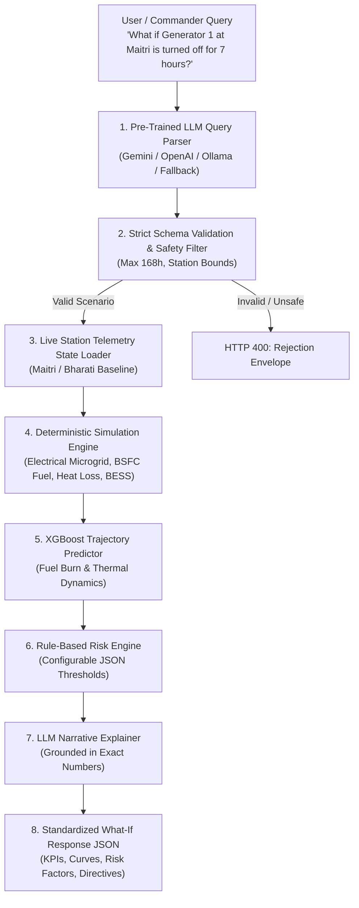

# DHRUVNETRA — What-If Analysis Engine API Documentation

**SIH 2026 Problem Statement**: *Digital Platform for Efficient Remote Management of Indian Antarctic Research Stations (Maitri & Bharati)*

---

## 1. Architecture Overview

The DHRUVNETRA What-If Analysis Engine implements a strict **Hybrid AI Architecture**:



> [!IMPORTANT]
> **LLM Arithmetic Prohibition**: Pre-trained LLMs are strictly prohibited from calculating numerical engineering results (power deficit, fuel consumption, temperatures, battery depletion). All numerical calculations are generated by deterministic multi-physics models and verified XGBoost regressors. The LLM only parses natural language intent and synthesizes grounded executive explanations.

---

## 2. Server Endpoints & Interactive Docs

| Endpoint | Method | Description |
| :--- | :--- | :--- |
| `/` | `GET` | API root metadata and sitemap |
| `/docs` | `GET` | Interactive Swagger UI documentation |
| `/redoc` | `GET` | ReDoc API specification viewer |
| `/openapi.json` | `GET` | OpenAPI 3.1 JSON schema definition |
| `/api/health` | `GET` | System health, uptime, and AI subsystem status |
| `/api/what-if` | `POST` | Primary What-If scenario execution endpoint |
| `/api/whatif/simulate`| `POST` | Direct alias for `/api/what-if` |

---

## 3. Endpoints Reference

### 3.1 System Health: `GET /api/health`

**Response (`200 OK`):**
```json
{
  "status": "healthy",
  "service": "DHRUVNETRA What-If Analysis Engine",
  "version": "1.0.0",
  "stations": ["Maitri", "Bharati"],
  "uptime_seconds": 124.5,
  "ai_subsystems": {
    "llm_parser": "ONLINE",
    "deterministic_simulation": "ONLINE",
    "xgboost_predictor": "ONLINE",
    "risk_engine": "ONLINE"
  }
}
```

---

### 3.2 What-If Analysis: `POST /api/what-if`

#### Request Body (`application/json`):
```json
{
  "query": "What if Generator 1 at Maitri is turned off for 7 hours?",
  "station": "Maitri",
  "state_overrides": {}
}
```

| Parameter | Type | Required | Description |
| :--- | :--- | :--- | :--- |
| `query` | `string` | **Yes** | Natural language operational question. |
| `station` | `string` | No | Optional station context (`"Maitri"` or `"Bharati"`). |
| `state_overrides` | `object` | No | Optional real-time telemetry overrides (e.g., `{"outdoor_temp_celsius": -35.0}`). |

---

#### Success Response (`200 OK`):
```json
{
  "success": true,
  "scenario": {
    "station": "Maitri",
    "component": "generator",
    "component_id": "G1",
    "action": "shutdown",
    "duration_hours": 7.0,
    "parameters": {},
    "confidence": 0.95,
    "raw_query": "What if Generator 1 at Maitri is turned off for 7 hours?"
  },
  "baseline": {
    "power_demand_kw": 96.5,
    "available_capacity_kw": 200.0,
    "fuel_burn_rate_lph": 26.4,
    "indoor_temp_c": 19.8,
    "battery_soc_pct": 94.2,
    "active_generators": ["G1", "G2"]
  },
  "prediction": {
    "power_demand_kw": 96.5,
    "available_capacity_kw": 100.0,
    "deficit_kw": 0.0,
    "projected_fuel_burn_lph": 26.2,
    "fuel_saved_liters": 1.2,
    "projected_temp_c": 19.8,
    "projected_battery_soc_pct": 94.2,
    "active_generators": ["G2"],
    "trajectory": [
      {
        "time": "+0.0h",
        "hour": 0.0,
        "currentLoad": 96.5,
        "projectedLoad": 96.5,
        "currentFuelBurn": 26.4,
        "projectedFuelBurn": 26.2,
        "fuelSavedRate": 0.2
      }
    ]
  },
  "impact": {
    "fuelSaved": 1.2,
    "fuelBurnChange": -0.2,
    "currentConsumption": 26.4,
    "projectedConsumption": 26.2,
    "currentLoad": 96.5,
    "projectedLoad": 96.5,
    "backupLoad": 96.5,
    "riskLevel": "MEDIUM",
    "riskScore": 55,
    "recommendation": "CAUTION ADVISED: Ensure automatic start sequence for G3 is armed.",
    "recommendationText": "Operating on N-0 redundancy with single generator at high load.",
    "systemsAffected": [
      {
        "name": "Gen 1 (Diesel 100 kW)",
        "role": "Base",
        "status": "OFFLINE",
        "impact": "Zero Output (Scheduled Maintenance)"
      },
      {
        "name": "Gen 2 (Diesel 100 kW)",
        "role": "Base",
        "status": "ACTIVE (98 kW / 98% LOAD)",
        "impact": "Carrying Full Base Load"
      }
    ]
  },
  "risk": {
    "overall_risk": "MEDIUM",
    "risk_score": 55,
    "factors": {
      "power_deficit": { "status": "SAFE", "value": 0.0 },
      "redundancy_loss": { "status": "WARNING", "value": "N-0" },
      "battery_soc": { "status": "FLOAT_NOMINAL", "value": 94.2 },
      "fuel_endurance": { "status": "SAFE", "value": 315.0 },
      "indoor_temperature": { "status": "NOMINAL", "value": 19.8 }
    },
    "reasons": ["Operating on N-0 redundancy with single generator at high load."],
    "recommended_action": "CAUTION ADVISED: Ensure automatic start sequence for G3 is armed."
  },
  "recommendation": "PROCEED WITH CAUTION: Maintain constant telemetry monitoring on active generator thermal load.",
  "explanation": "Simulating a 7.0-hour shutdown of G1 at Maitri. Station electrical load shifts to backup active units with 98 kW (98% on G2). Station microgrid remains stable with 0.0 kW deficit and projected fuel delta of 1.2 L. Redundancy is reduced to N-0 during this operational window.",
  "chartData": [...],
  "aiResponse": "DHRUVNETRA AI OPERATIONAL ASSESSMENT...",
  "provider_used": "gemini (gemini-1.5-flash)",
  "error": null
}
```

---

#### Validation Error / Scenario Rejection (`400 Bad Request`):
When a query requests unsafe durations ($> 168$ hours), invalid stations, or non-existent assets:
```json
{
  "success": false,
  "status_code": 400,
  "error": "Scenario rejected due to validation constraints: Duration exceeds maximum safety limit of 168 hours / 7 days (got 300.0).",
  "validation_errors": [
    "Duration exceeds maximum safety limit of 168 hours / 7 days (got 300.0)."
  ],
  "raw_query": "What if Generator 1 at Maitri is turned off for 300 hours?"
}
```

---

## 4. Running the Backend Server Locally

```bash
# Start FastAPI server on port 8000
python -m uvicorn backend.app.main:app --host 0.0.0.0 --port 8000 --reload
```

---

## 5. Automated Test Suite

Run full end-to-end integration and assertion tests:
```bash
# Test API Routes & HTTP Contracts
python -m backend.app.test_api

# Test Deterministic Multi-Physics Simulation Engine
python -m backend.simulation.test_simulation

# Test LLM Natural-Language Query Parser
python -m backend.ai.llm.test_parser
```
